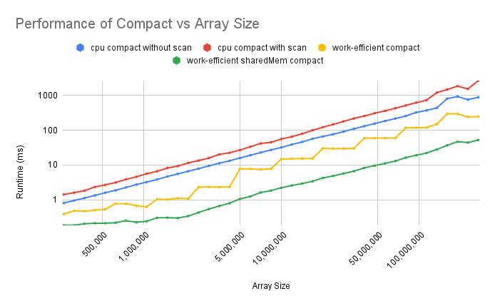
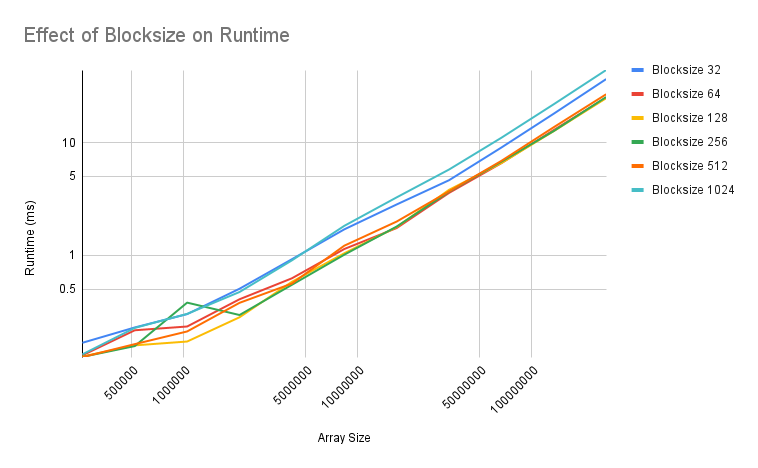

CUDA Stream Compaction
======================

**University of Pennsylvania, CIS 565: GPU Programming and Architecture, Project 2**

* Aaron Jiang
  * [LinkedIn](https://www.linkedin.com/in/aaronpjiang/), [personal website](https://aaron-jiang.com/)
* Tested on: Windows 11, i5-13420H @ 1.99GHz 16GB, GTX 4050 16MB (Personal Computer)

### CUDA Scan, Stream Compaction & Radix Sort

This repository contains several GPU implementations of the `SCAN` and `STREAM COMPACTION` algorithms. `STREAM COMPACTION` is used to compress an array by discarding unwanted elements and collapsing the array down using `SCAN`.  
`SCAN` is best exemplified by the Prefix Sum problem - the output of `SCAN` on an `arr1[1..n]` is the array `arr2` such that `arr2[i] = arr[1]`$\oplus$`arr[2]`$\oplus \cdots \oplus$ `arr[i]`, for some operator $\oplus$. When the operator is addition, the problem described is Prefix Sum.
This assignment also implements both extra credit features of using shared memory and hardware optimization, and implementing `radixSort`.

This repository implements 5 `SCAN` algorithms.
##### CPU Scan
The simplest `SCAN` runs on the CPU. By keeping a running total, we can add the next element and use the total to output `arr[i]`.
```python
currTotal = 0
for i <- 1..arraySize
  currTotal += inputArr[i]
  outputArr[i] = currTotal
```
This algorithm is strictly sequential, as each following iteration of the for loop is dependent on the previous iteration. This algorithm is therefore hard to parallelize and so becomes quite slow at large arrays. This scales at `O(n)`.
##### GPU Naive Scan
We can observe that each array entry needs to have all the array indices before it is added into its output entry. We can do this in parallel, meaning we can utilize the GPU. One way to ensure all numbers before an index are accounted for is to first add the index $2^0$ elements before it, then $2^1$, then $2^2$, until out of range. 
```python
# CPU 
for stride <- 1...arraySize, stride *= 2:
  # Kernel
  if threadId + stride < arraySize:
    arr[kernelId + stride] += arr[kernelId]
```
Assuming we have `n` processors on the GPU, this brings the runtime complexity down to `O(log n)`! However, in reality, the number of processors on the GPU is limited, so we are limited by the number of additions (or other operations). This algorithm uses `O(nlog n)` additions, which is greater than the CPU scan.

##### GPU Work-Efficient Scan
To get the additions down, we can use a two stage approach introduced in Blelloch 1990. The `upsweep` stage builds a "tree" in the array in-place with the following property: if `2^j` is the maximum power of two that divides `i`, then `outputArr[i] =`$\sum_{k=i-2^j}^i$ `arr[k]`.
```python
Upsweep:
  # CPU
  for stride <- 1..arraySize, stride *= 2:
    # Kernel
    if threadId % stride == 0:
      arr[kernelId + stride] += arr[kernelId]
```
This seems like it is strictly a more selective version of the Naive Scan, but the time save comes from the fact that the GPU scheduler knows when a warp does not do work, and frees its processor to be able to do other work.  
To complete the algorithm, we need to implement `downsweep`, which uses the properties in the array to ensure every index gets every number prior to its index in its sum. In `downsweep`, we call the next value `arr[i]` will take as the right child of the current `arr[i]`, and `arr[i/2]` will be the left child. The right child will `= arr[i] + arr[i/2]`, and the left will `= arr[i]`.
```python
Downsweep:
# CPU
# Set top of "tree" as 0
arr[arraySize - 1] = 0
for stride <- 1..arraySize, stride *= 2:
  # Kernel
  if threadId % stride == 0:
    temp = arr[i]
    arr[i] += arr[i/2]
    arr[i/2] = temp
```
Both `upsweep` and `downsweep`, with `n` processors, would also take `log(n)` time. But in terms of additions, this work-efficient algorithm also has the advantage in that it only performs `O(n)` operations, so even considering a finite processor amount, performs the same asymptotically as the CPU algorithm.

### First Results
Let's see how these two parallel algorithms compare to the sequential CPU algorithm. The following plot is in log-log scale. It also includes the scan function from the Thrust library as an upper limit of what GPU compute can do.

  |  
:-------------------------:|:-------------------------:

*Figures 1 & 2: Graphs plotting the performance of different Scan strategies against the size of the array in log-log scale.*
##### Chart with Representative Values
Array Size | CPU|Naive| Efficient|Thurst
:--:|--:|--:|--:|--:
1,048,576|0.51|0.67|0.58|0.83
4,194,304|2.57|7.04|1.73|1.33
33,554,432|22.7|84.3|24.4|3.40
134,217,728|87.8|360.8|101.5|11.1

Since GPU algorithms often rely on our array size being a power of two, I have provided two graphs, a less dense graph of performance at power-of-two sizes, and a more dense graph of performance at non-power-of-two sizes.  
Both the Naive and Work-Efficient algorithms are a disappointment, being slower than CPU. Work-Efficient comes close but Naive takes significantly more time than the CPU execution. One of the factors most slowing down these GPU algorithms is the high amount of global memory reads.

##### Naive Shared Memory Scan

Before, we were reading from global memory for every needed addition. We can take an alternate approach using the shared memory on the GPU. One complication is that shared memory can only be accessed within a block, a scheduling component holding at most 1024 threads (depending on hardware).

That means we cannot process the whole array in one block. We can instead process all of a block's elements in each block, and output the sum of the block for each block.

To implement shared memory naive scan, we can transfer data from global memory to shared memory, increase our stride until reaching our blocksize, and create a partial scan for that block. If we get the total from every block, we can turn the partial scan into a full scan by running a scan on that higher-level array and adding it back to our original blocks.
```python
# CPU
for i <- 1..log_blocksize(n):
  # Kernel adding up each block using the stride method
  extern __shared int s[]
  s[threadId] = arr[id]
  for stride <- 1..blockDim, stride *= 2:
    if threadId + stride < arraySize:
      s[threadId + stride] += s[threadId]
  # Write to global memory and parent array
  arr[id] = s[threadId]
  if threadId == blocksize - 1:
    parent[blockId] = s[threadId]

# CPU
for i <- 1..log_blocksize(n):
  # Kernel adding up the prefixes
  arr[i] += parent[blockId]
```
Since we can process ten strides' worth of adds in a kernel, rather than just one, this algorithm has up to 10 times less global memory reads!

##### Work-Efficient Shared Memory
Similar to before, shared memory only persists within a block. We can account for this by outputing our values up into an array of size numBlocks when sweeping up, and when we downsweep we can start from there.

```python
// CPU
for i <- 1..log_blocksize(n):
  # Kernel adding up each block using the stride method
  extern __shared int s[]
  s[threadId] = arr[id]
  for stride <- 1..blockDim, stride *= 2:
    if threadId % stride == 0:
      arr[kernelId + stride] += arr[kernelId]
  # Write to global memory and parent array
  arr[id] = s[threadId]
  if threadId == blocksize - 1:
    parent[blockId] = s[threadId]
```

``` python
// CPU
for i <- 1..log_blocksize(n):
  # Kernel for downsweep
  extern __shared int s[]
  s[threadId] = arr[id]
  for stride <- 1..arraySize, stride *= 2:
    if threadId % stride == 0:
      temp = s[i]
      s[i] += s[i/2]
      s[i/2] = temp
  # Write to global memory
  arr[id] = s[threadId]
```

This will similarly reduce the global memory reads tenfold.

##### Compact
Stream Compaction is an algorithm that uses scan. First we can map our array of values into a boolean array that encodes whether we want to keep the item or not. The basic premise is that we can use Scan to create a prefix sum array of that boolean array. This prefix sum array will tell what index each item we want to keep should be in in the completed array.

#### Radix Sort
Radix Sort is another algorithm that uses Scan. Radix sort works by sorting an array first by its least significant bit, which can be done in a way very similar to stream compaction, and then repeating with more and more significant bits until the sort is completed. This repo implements a simple Radix sort that calls the sorting kernel 32 times - one for each bit in a 32-bit number.
### Final Results and Performance Analysis

#### Scan

  |  
:-------------------------:|:-------------------------:

*Figures 3 & 4: Graphs plotting the performance of different Scan strategies, now using shared memory, against the size of the array in log-log scale.*
##### Chart with Representative Values
Array Size | CPU|Naive| Naive Shared Mem| Efficient| Efficient Shared Mem| Thurst
:--:|--:|--:|--:|--:|--:|--:
1,048,576|0.51|0.67|0.19|0.58|0.27|0.83
4,194,304|2.57|7.04|0.46|1.73|0.49|1.33
33,554,432|22.7|84.3|4.19|24.4|3.26|3.40
134,217,728|87.8|360.8|20.2|101.5|16.78|11.1

We now see that the shared memory implementations of these algorithms are much more competitive with Thrust's implementation. We see Naive with shared memory sees a **3.5x to 20x** decrease, and Work-Efficient with shared memory sees a **2.15x to 7.5x** decrease.
Naive Shared-Mem is the fastest algorithm between array sizes of approximately 250k to 5 million, then Efficient Shared-Mem is the fastest between approximately 5 million to 50 million before being outclassed by Thrust.

#### Compact
This repo has implementations for compact both on the CPU and the GPU. There are two CPU implementations, one sequential, and one mirroring the parallel workflow of the GPU's compact. The GPU implementations differ only by which scan they are using, with the regular GPU using the work-efficient, and the shared memory GPU strategy using the work-efficient shared-mem implementation. We can see the shared memory GPU strategy outperforms the three others. 

  

*Figure 5: A graph plotting the runtime performance of various scan strategies vs array size. This graph is in log-log scale. Lower is better.*

### Performance Analysis

The Work-Efficient Shared-Memory implementation contains several optimizations that represent high level concepts in GPU optimization. The biggest is the **reduction in global memory** reads as we can run the calculation for up to the equivalent of 10 stride increments from the previous version, leading to 10x less global memory reads.
Another optimization was the elimination of **high-instruction operations**. In particular, the modulo operator takes hundreds of cycles on the GPU, so I initially replaced it with a bitwise operation.
```python
if threadId % stride == 0: 
```
can become
```python
if (threadId & 1 << (stride - 1)) == 0:
```


A final optimization done is the **divergent warp reduction**. At this level, we face a problem in that, when the stride is 4, every fourth thread activates and the other three threads are simply idling. This is an inefficient use of GPU resources as adjacent threads will run in the same warp. If all the threads in the warp, that is all the threads in a consecutive area were to all idle, the warp could quit early and free up that compute for more useful calculations.

To have only consecutive threads perform our calculation, we can simply demand only the first $n/2^{\text{stride}}$ threads do work. Now the threads that will not do work are all consecutive, allowing those warps to return early.
```python
if (stride * threadId < blocksize) {
  arr[stride * threadId + (stride / 2)] += arr[stride * threadId]
}
```

As a bigger block in allows the use of shared memory for longer, I had expected the Work-Efficient Shared-Mem algorithm to perform better on increased block sizes. Plotting the times vs block size reveals no clear winner, except that the two extremes, block size 32 and block size 1024, are slower. This may be because of their inflexibility in the scheduler.
  
*Figure 6: The Runtime of the Work-Efficient Shared-Mem Algo on array sizes 2^18 through 2^28. Each blocksize power of two is plotted separately.*

Running NSight Compute with block size 32 reveals its theoretical compute capacity is only at 50%, as each scheduler on my machine can handle 12 warps but is given 6 to schedule, again because of the low warp count per block. NSight Compute with block size 1024 similarly reveals a low theoretical compute capcity due to warp scheduling.

A similar effect is noted for the Naive Shared-Mem algorithm.

Metric | Throughput
--:|--:
Compute (SM) Throughput	| 82.14 %
Memory Throughput	| 82.14 %
L1/TEX Cache Throughput	| 82.13 %
L2 Cache Throughput	| 11.28 %
DRAM Throughput	| 63.75 %

*Table 3: Throughput values produced by Nsight Compute on the Work-Efficient Shared-Mem algorithm on an array of size 2^28*

The Work-Efficient Shared-Mem algorithm is quite optimized, having a GPU Occupancy of 92.30%. Nsight Compute produced these values to measure throughput throughout the program. Since DRAM's bandwidth usage is lower the the compute throughput, this suggests this algorithm is **compute limtited**.

Metric | Throughput
--:|--:
Compute (SM) Throughput |	88.49 %
Memory Throughput |	88.49 %
L1/TEX Cache Throughput |	88.50 %
L2 Cache Throughput |	7.65 %
DRAM Throughput |	43.21 %

*Table 4: Throughput values produced by Nsight Compute on the Naive Shared-Mem algorithm on an array of size 2^28*

The Naive Shared-Mem algorithm has an even higher GPU Occupancy of 96.72%, but the lowness of the DRAM throughput implies this algorithm is also **compute limited**. It is slightly less balanced in resource use than the Work-Efficient Shared-Mem Algorithm.

I also looked into what causes Thrust to run quickly at higher numbers but less so in lower numbers. Running Thrust's scan in Nsight Compute reveals it only runs 2 kernels. This means they are likely not doing a recursive upsweep & downsweep setup but an entirely different algorithm. Something that also stood out to me was its low grid size on `DeviceScanKernel`, being only 139811 when the array size was 2^28. Its block size was also 128, meaning each thread would each have to resolve 14.999  numbers in the array (very close to 15, which makes me suspicious that it was designed that way).

### Future Work
One optimization that I have not yet done was protection against bank conflicts in both Naive Shared-Mem and Work-Efficient Shared-Mem implementations. Particularly for `upsweep` and `downsweep`, these kernels can ask for strided reads of different elements in shared memory from the same bank. This can be rectified using padding, as specifed in GPU Gem Ch 39 Section 39.2.3.

Radix Sort can also be improved. Right now we are launching a separate kernel for each byte. However we can have a kernel that does 10 bytes at once if we utilize shared memory to simply sort the block. The downside would be, then a parallel bitonic sort would be needed to merge the blocks together.

### Sample Output
Here is a sample output at array size = 2^28.
```

****************
** SCAN TESTS **
****************
    [  44  30  37  36  49  18  23  38  17  26  30  12  43 ...  23   0 ]
==== cpu scan, power-of-two ====
   elapsed time: 316.133ms    (std::chrono Measured)
    [   0  44  74 111 147 196 214 237 275 292 318 348 360 ... -2015554129 -2015554106 ]
==== cpu scan, non-power-of-two ====
   elapsed time: 191.214ms    (std::chrono Measured)
    [   0  44  74 111 147 196 214 237 275 292 318 348 360 ... -2015554185 -2015554180 ]
    passed
==== naive scan, power-of-two ====
   elapsed time: 1122.12ms    (CUDA Measured)
    passed
==== naive scan, non-power-of-two ====
   elapsed time: 780.456ms    (CUDA Measured)
    passed
==== naive scan, shared memory, power-of-two ====
   elapsed time: 34.1846ms    (CUDA Measured)
    passed
==== naive scan, shared memory, non-power-of-two ====
   elapsed time: 31.9483ms    (CUDA Measured)
    passed
==== work-efficient scan, power-of-two ====
   elapsed time: 193.106ms    (CUDA Measured)
    passed
==== work-efficient scan, non-power-of-two ====
   elapsed time: 208.203ms    (CUDA Measured)
    passed
==== work-efficient scan, shared memory, power-of-two ====
   elapsed time: 26.9703ms    (CUDA Measured)
    passed
==== work-efficient scan, shared memory, non-power-of-two ====
   elapsed time: 29.4635ms    (CUDA Measured)
    passed
==== thrust scan, power-of-two ====
   elapsed time: 410.724ms    (CUDA Measured)
    passed
==== thrust scan, non-power-of-two ====
   elapsed time: 13.4805ms    (CUDA Measured)
    passed

*****************************
** STREAM COMPACTION TESTS **
*****************************
    [   0   1   2   3   0   3   2   2   0   3   3   2   1 ...   0   0 ]
==== cpu compact without scan, power-of-two ====
   elapsed time: 672.273ms    (std::chrono Measured)
    [   1   2   3   3   2   2   3   3   2   1   1   2   3 ...   2   1 ]
    passed
==== cpu compact without scan, non-power-of-two ====
   elapsed time: 683.18ms    (std::chrono Measured)
    [   1   2   3   3   2   2   3   3   2   1   1   2   3 ...   3   2 ]
    passed
==== cpu compact with scan ====
   elapsed time: 2304.3ms    (std::chrono Measured)
    [   1   2   3   3   2   2   3   3   2   1   1   2   3 ...   2   1 ]
    passed
==== work-efficient compact, power-of-two ====
   elapsed time: 262.924ms    (CUDA Measured)
    passed
==== work-efficient compact, non-power-of-two ====
   elapsed time: 262.903ms    (CUDA Measured)
    passed
==== work-efficient sharedMem compact, power-of-two ====
   elapsed time: 60.6653ms    (CUDA Measured)
    passed
==== work-efficient sharedMem compact, non-power-of-two ====
   elapsed time: 57.6725ms    (CUDA Measured)
    passed
    [ 22529 3677 20404 19740 1166 13158 15043 28333 9184 17566 18384 23207 9930 ... 31276   0 ]
==== Radix Sort ====
   elapsed time: 1805.08ms    (CUDA Measured)
    passed
```
